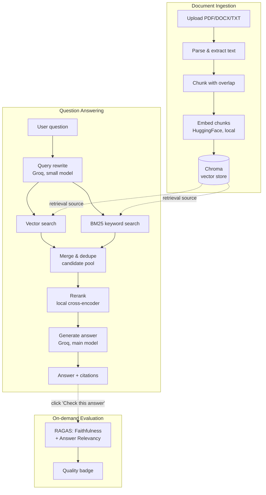

# RAGcore

A production-oriented Retrieval-Augmented Generation (RAG) web application. Upload a document, ask questions about it, and get answers grounded in the source text — with citations, hybrid retrieval, reranking, and on-demand answer quality scoring.

Built as a portfolio project to demonstrate a complete, real-world RAG pipeline — not just a naive "embed and retrieve" demo.


---

## Features

- **Document ingestion** — upload PDF, DOCX, or TXT files, parsed and chunked automatically
- **Local embeddings** — HuggingFace sentence-transformers, no external embedding API or cost
- **Hybrid retrieval** — combines vector similarity search (Chroma) with keyword search (BM25), so both semantic and exact-match queries are covered
- **Query rewriting** — a small, fast LLM reformulates vague questions before retrieval
- **Reranking** — a local cross-encoder re-scores retrieved candidates for precision, before anything reaches the LLM
- **Grounded generation** — Groq-hosted LLM answers strictly from retrieved context, with source citations (filename, page, passage)
- **On-demand answer evaluation** — click "Check this answer" on any response to get live Faithfulness and Answer Relevancy scores (via RAGAS), judged by the same LLM already powering the app
- **No separate frontend build** — a single FastAPI service serves both the API and a static HTML/CSS/JS interface; one process, one deployable unit

---

## Architecture



**Design choices worth noting:**
- BM25 index is rebuilt per-query from Chroma's stored chunks rather than maintained as a separate persistent index — simple and fast at portfolio scale; the natural next step if this needed to scale further.
- Query rewriting uses a smaller/faster Groq model than answer generation, since reformulating a question doesn't need the same reasoning power.
- Reranking runs against the *original* question, not the rewritten one — the rewrite is a retrieval aid, but final relevance should reflect what the user actually asked.
- Chunks scoring below a relevance floor after reranking are dropped entirely, even if it means answering "I couldn't find anything relevant" instead of padding the context with weak matches.

---

## Tech stack

| Layer | Choice |
|---|---|
| Backend framework | FastAPI |
| RAG orchestration | LangChain |
| LLM | Groq (`llama-3.3-70b-versatile` for answers, `llama-3.1-8b-instant` for query rewriting) |
| Embeddings | HuggingFace `sentence-transformers` (local, free) |
| Vector store | Chroma (persistent, local) |
| Keyword retrieval | BM25 (`rank_bm25`) |
| Reranker | Local cross-encoder (`cross-encoder/ms-marco-MiniLM-L-6-v2`) |
| Answer evaluation | RAGAS (Faithfulness, Answer Relevancy) |
| Metadata storage | SQLite (SQLAlchemy) |
| Frontend | Static HTML/CSS/JS, served directly by FastAPI |
| Config | `pydantic-settings`, `.env` |

---

## Project structure

```
RAGcore/
├── app/
│   ├── main.py                 # FastAPI entrypoint, static file serving
│   ├── config.py                # typed settings loaded from .env
│   ├── api/routes/
│   │   ├── upload.py             # POST /documents/upload
│   │   ├── documents.py          # GET/DELETE /documents
│   │   ├── query.py              # POST /query
│   │   └── evaluate.py           # POST /evaluate
│   ├── core/                    # the actual RAG pipeline
│   │   ├── document_loader.py    # PDF/DOCX/TXT parsing
│   │   ├── text_splitter.py      # chunking
│   │   ├── embeddings.py         # HuggingFace embedding model
│   │   ├── vectorstore.py        # Chroma wrapper
│   │   ├── query_rewrite.py      # query reformulation
│   │   ├── hybrid_retriever.py   # vector + BM25 merge
│   │   ├── reranker.py           # cross-encoder reranking
│   │   ├── rag_chain.py          # orchestrates the full pipeline
│   │   ├── answer_evaluator.py   # RAGAS scoring
│   │   └── ingestion.py          # ties loader→splitter→vectorstore together
│   ├── db/                      # SQLite metadata (document records)
│   └── models/
│       └── schemas.py            # API request/response contracts
├── static/                      # frontend (HTML/CSS/JS, no build step)
├── data/                         # gitignored — Chroma DB, uploads, SQLite file
├── notebook/
├── scripts/
│   └── verify_pipeline.py        # standalone diagnostic for the retrieval pipeline
├── requirements.txt
└── .env.example
```

---

## Getting started

### Prerequisites
- Python 3.10+
- A free [Groq API key]


## API reference

| Endpoint | Method | Purpose |
|---|---|---|
| `/documents/upload` | POST | Upload and ingest a document |
| `/documents` | GET | List uploaded documents |
| `/documents/{id}` | DELETE | Delete a document and its vectors |
| `/query` | POST | Ask a question, get an answer + sources |
| `/evaluate` | POST | Score an answer's faithfulness and relevancy |
| `/health` | GET | Health check |

Full interactive API docs (Swagger UI) available at `/docs` when running.

---

## Configuration

All configuration lives in `.env` . Key knobs:

| Variable | Purpose |
|---|---|
| `GROQ_MODEL` | Main answer-generation model |
| `QUERY_REWRITE_MODEL` | Smaller/faster model for query reformulation |
| `CHUNK_SIZE` / `CHUNK_OVERLAP` | Document chunking parameters |
| `RETRIEVAL_CANDIDATE_K` | Candidates pulled from each retriever before merging |
| `RERANK_TOP_N` | Final chunk count after reranking |
| `RERANK_MIN_SCORE` | Relevance floor — chunks below this are dropped |

---
